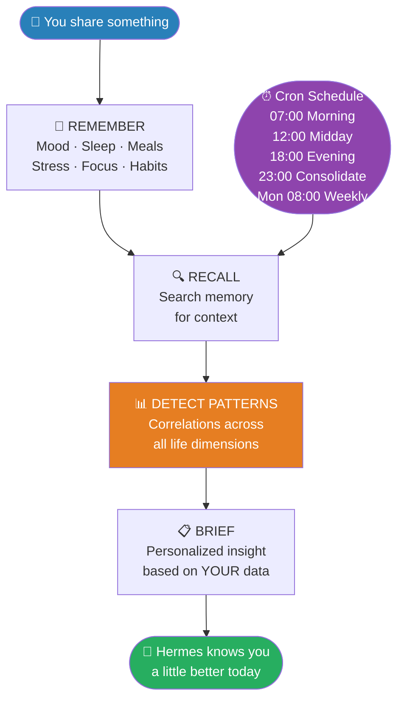
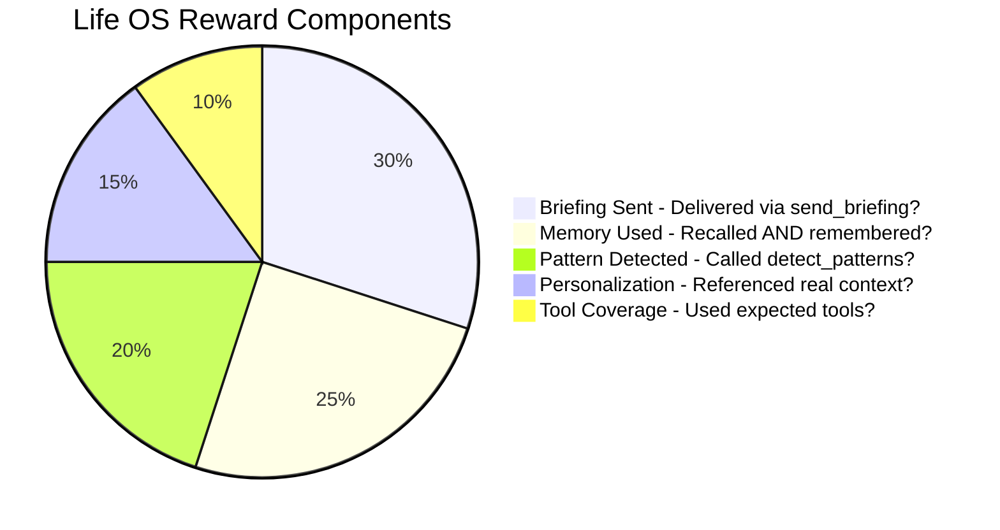
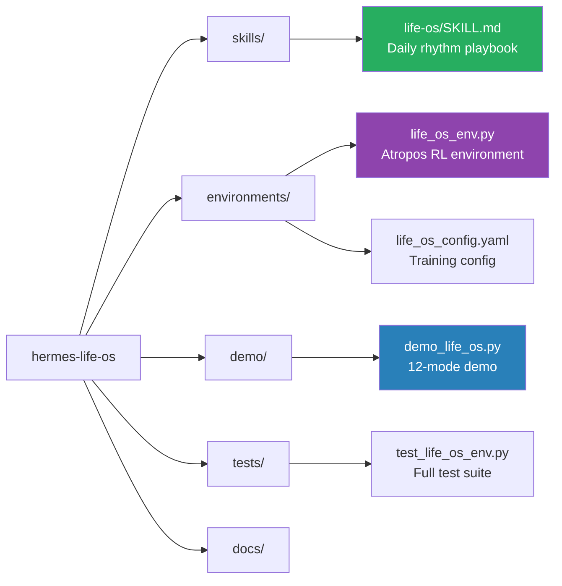

# Hermes Life OS 🧠

**The personal OS that grows with you.**

> Built for the NousResearch "Show us what Hermes Agent can do" hackathon.

Most productivity tools forget you the moment you close them.
Hermes Life OS remembers everything - your mood, your meals, your sleep, your stress,
your wins and your struggles - and gets smarter about you every single day.

## What It Does

Tell it how you feel. Log what you ate. Track your sleep.
Over time it starts connecting dots you haven't: energy crashes after poor sleep,
mood dips on low-hydration days, focus drops when stress spikes.
Every morning it briefs you. Every evening it reflects with you.
Every week it tells you what the data says about your life.

**The longer you use it, the more it knows. The more it knows, the more useful it becomes.**

## Architecture



## Hermes Features Used

| Feature | How It's Used |
|---------|--------------|
| **Memory** | Stores every mood, meal, sleep entry, workout, stress log - recalls before every response |
| **Skills** | Life OS playbook defines daily rhythm, pattern detection rules, and briefing format |
| **Cron** | Automated briefings at 07:00, 12:00, 18:00, 23:00, and weekly Monday reviews |
| **Gateway** | Delivers briefings via terminal - extensible to Telegram, email, SMS |
| **Subagents** | Pattern detection runs across all health dimensions in parallel |
| **Atropos RL** | Reward function trains Hermes to be more personal and memory-driven over time |

## Tracking Capabilities

| Category | What Hermes Tracks |
|----------|-------------------|
| 🥗 Nutrition | Meals, calories, protein/carbs/fat, daily totals |
| 😴 Sleep | Duration, quality score, 7-day averages |
| 💧 Hydration | Daily water intake with progress bar |
| 💪 Fitness | Workouts, duration, intensity, weekly count |
| 🧘 Mental | Stress levels, meditation sessions, gratitude logs |
| 🎯 Focus | Deep work sessions, distractions, quality scores |
| ✅ Habits | Streaks, best streaks, completion tracking |
| 🎯 Goals | Progress percentages, milestones, notes |
| 😊 Mood & Energy | Daily scores, trend detection, dip alerts |

## Pattern Detection

Hermes automatically detects and surfaces:
- Mood dips lasting 3+ consecutive days
- Sleep deprivation affecting focus and mood
- Energy crashes correlated with nutrition gaps
- Stress spikes and their triggers
- Habit streaks worth celebrating
- Goal stalls that need a nudge
- Hydration gaps on high-stress days

## Reward Function



## Quick Start

```bash
pip install openai rich
set OPENROUTER_API_KEY=sk-or-...

python demo/demo_life_os.py --mode onboard
python demo/demo_life_os.py --mode morning
python demo/demo_life_os.py --mode chat
```

## All Demo Modes

| Mode | What Happens |
|------|-------------|
| `onboard` | First-time setup - Hermes learns who you are |
| `morning` | Daily briefing based on all your patterns |
| `checkin` | Midday log - mood, habits, quick nudge |
| `evening` | Evening reflection - wins, struggles, patterns |
| `weekly` | Sunday review - what this week says about you |
| `nutrition` | Log meals and get nutrition insights |
| `sleep` | Log sleep and get sleep analysis |
| `fitness` | Log workouts and track fitness patterns |
| `mental` | Log stress, meditation, and gratitude |
| `focus` | Log deep work sessions and productivity |
| `health` | Full health dashboard - all data in one view |
| `dream` | **Dream journal** - log dreams, detect patterns, sleep/stress correlation |
| `chat` | **Interactive conversation** - type anything |

## Chat Mode

```bash
python demo/demo_life_os.py --mode chat
```

Type naturally. Hermes responds using everything it knows about you.
Type `exit` to leave.

Example conversations:
- "I feel stressed today, any advice?"
- "Log my lunch - grilled chicken and rice, about 600 calories"
- "How has my sleep been this week?"
- "I just ran 5km, log it"
- "What patterns are you seeing in my data?"

## Project Structure



## Voice Mode

```bash
python demo/demo_life_os.py --voice --model google/gemini-2.0-flash-001
```

Speak to Hermes directly. It listens via microphone, processes your input using
everything it knows about you, and responds out loud via system TTS.

No extra API key needed - uses built-in Windows/Linux speech synthesis.

To stop: say or type `exit`

---

## What's New

**v1.3.0 - Dream Journal**
- Dream logging mode with symbol, emotion, tone and vividness tracking
- Sleep/mood/stress/dream correlation detection
- Recurring symbol pattern detection across 30 days
- Morning briefing includes dream analysis

**v1.2.0 - Voice & Performance**
- Voice mode - speak to Hermes, hear responses via system TTS
- Concurrent tool execution - read-only tools run in parallel threads
- Microphone input via SpeechRecognition

**v1.1.0 - Health & Wellness Expansion**
- Nutrition, sleep, hydration, fitness, mental, focus tracking
- Full health dashboard and weekly health report
- Interactive chat mode

**v1.0.0 - Initial Release**
- 12 demo modes covering every life dimension
- Pattern detection across mood, sleep, nutrition, stress, focus
- Memory-driven briefings, Atropos RL environment

---

## Running Tests

```bash
python -m pytest tests/ -v
python -c "from environments.life_os_env import smoke_test; smoke_test()"
```

## Why This Is Different

Every other agent in this hackathon does something **for** you.
Hermes Life OS becomes something **with** you.

It tracks nutrition, sleep, fitness, stress, focus, hydration, habits, and goals -
and connects them all. Bad Monday? It checks if you slept poorly Sunday.
Energy crash at 3pm? It looks at what you ate for lunch.
Mood dip this week? It finds the pattern you missed.

That is not a tool. That is a presence that accumulates.
