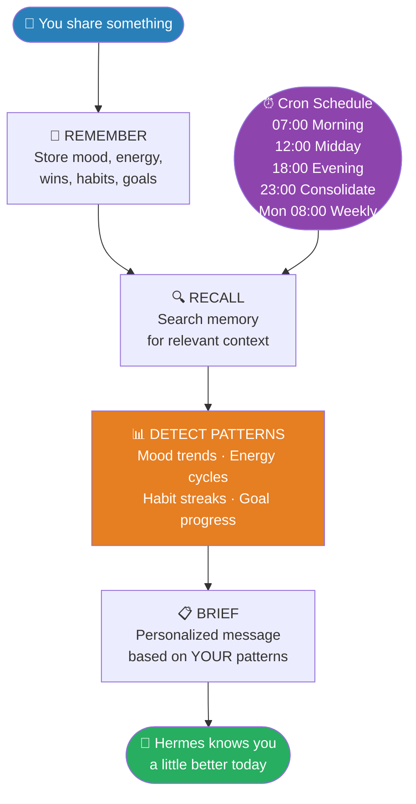
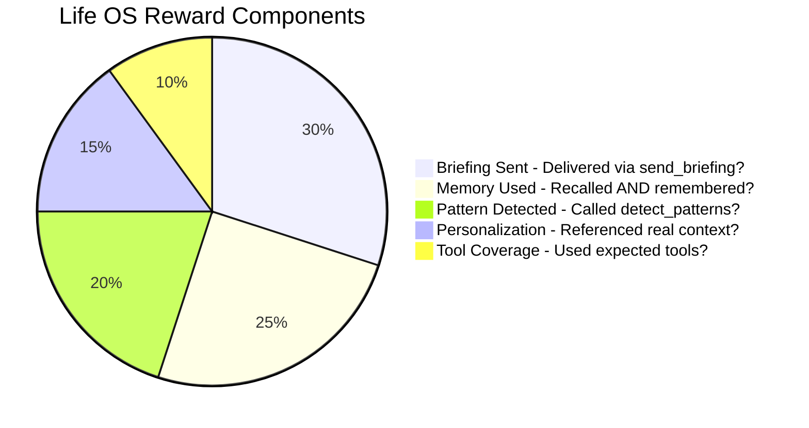

# Hermes Life OS 🧠

**The agent that grows with you.**

> Built for the NousResearch "Show us what Hermes Agent can do" hackathon.

Most agents complete a task and forget you exist.
Hermes Life OS remembers everything, detects patterns in your life,
and shows up every morning knowing you a little better than the day before.

## What It Does

Give it your day. It remembers your mood, your wins, your habits, your struggles.
Over time it starts noticing things you haven't — three bad Mondays in a row,
an energy crash that always hits at 3pm, a habit streak you didn't realize you were building.

Every morning it briefs you. Every evening it reflects with you.
Every week it tells you what it's seeing.

**The longer you use it, the more it knows. The more it knows, the more useful it becomes.**

## Architecture



## Hermes Features Used

| Feature | How It's Used |
|---------|--------------|
| **Memory** | Stores every mood, win, struggle, habit, goal - recalls context before every response |
| **Skills** | Life OS playbook defines the full daily rhythm and pattern detection rules |
| **Cron** | Automated briefings at 07:00, 12:00, 18:00, 23:00, and weekly Monday reviews |
| **Gateway** | Delivers briefings via terminal - extensible to Telegram, email, SMS |
| **Subagents** | Pattern detection runs as a parallel analysis before every briefing |
| **Atropos RL** | Reward function trains Hermes to be more personal, more memory-driven over time |

## Reward Function



## Quick Start

```bash
pip install openai rich
set OPENROUTER_API_KEY=sk-or-...

python demo/demo_life_os.py --mode onboard
python demo/demo_life_os.py --mode morning
python demo/demo_life_os.py --mode checkin
python demo/demo_life_os.py --mode evening
python demo/demo_life_os.py --mode weekly
```

## Demo Modes

| Mode | What Happens |
|------|-------------|
| `onboard` | First-time setup - Hermes learns who you are |
| `morning` | Daily briefing based on your patterns |
| `checkin` | Midday log - mood, habits, quick nudge |
| `evening` | Evening reflection - wins, struggles, patterns |
| `weekly` | Sunday review - what this week says about you |

## Memory Schema

Everything Hermes stores about you:

```
MOOD     → date · score (1-10) · note
ENERGY   → date · level (low/medium/high) · context
HABIT    → name · streak · last_done
GOAL     → name · progress % · deadline · last_note
WIN      → date · description
STRUGGLE → date · description · resolved
INSIGHT  → date · observation · confidence
```

## Project Structure


## Running Tests

```bash
python -m pytest tests/ -v
# or:
python -c "from environments.life_os_env import smoke_test; smoke_test()"
```

## Why This Is Different

Every other agent in this hackathon does something **for** you.
Hermes Life OS becomes something **with** you.

It's not a tool you pick up when you need it.
It's a presence that accumulates - quietly, in the background -
until one morning it says something that makes you realize it knows you better than you thought.

That's what "grows with you" actually means.
