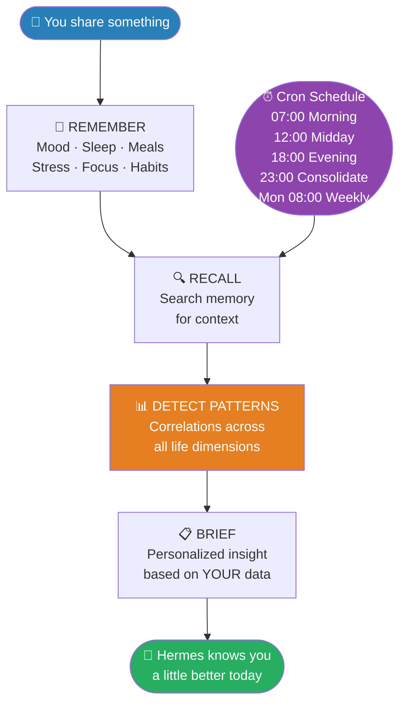
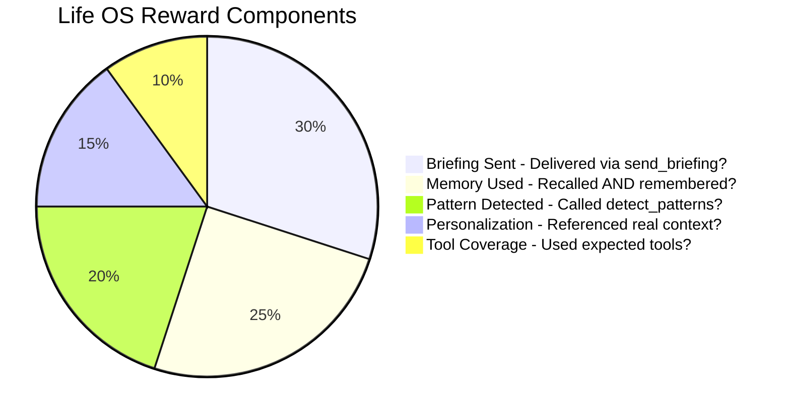
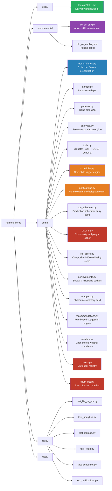
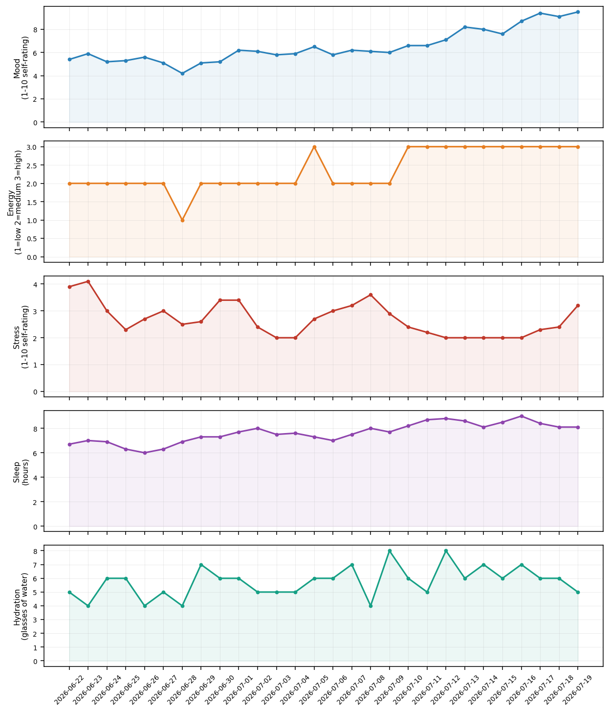

# Hermes Life OS 🧠

[](https://github.com/Lethe044/hermes-life-os/actions/workflows/tests.yml)
[](https://pypi.org/project/hermes-life-os/)
[](https://www.python.org/downloads/)
[](LICENSE)

**The personal OS that grows with you.**

> Built for the NousResearch "Show us what Hermes Agent can do" hackathon.

Most productivity tools forget you the moment you close them.
Hermes Life OS remembers everything - your mood, your meals, your sleep, your stress,
your wins and your struggles - and gets smarter about you every single day.

## What It Does

Tell it how you feel. Log what you ate. Track your sleep.
Over time it starts connecting dots you haven't: energy crashes after poor sleep,
mood dips on low-hydration days, focus drops when stress spikes.
Every morning it briefs you. Every evening it reflects with you.
Every week it tells you what the data says about your life.

**The longer you use it, the more it knows. The more it knows, the more useful it becomes.**

## Architecture


```mermaid
flowchart TD
    A([👤 You share something]) --> B
    B[🧠 REMEMBER<br/>Mood · Sleep · Meals<br/>Stress · Focus · Habits] --> C
    C[🔍 RECALL<br/>Search memory<br/>for context] --> D
    D[📊 DETECT PATTERNS<br/>Correlations across<br/>all life dimensions] --> E
    E[📋 BRIEF<br/>Personalized insight<br/>based on YOUR data] --> F
    F([🌱 Hermes knows you<br/>a little better today])

    G([⏰ Cron Schedule<br/>07:00 Morning<br/>12:00 Midday<br/>18:00 Evening<br/>23:00 Consolidate<br/>Mon 08:00 Weekly]) --> C

    style A fill:#2980b9,color:#fff
    style F fill:#27ae60,color:#fff
    style G fill:#8e44ad,color:#fff
    style D fill:#e67e22,color:#fff
```

## Hermes Features Used

| Feature | How It's Used |
|---------|--------------|
| **Memory** | Stores every mood, meal, sleep entry, workout, stress log - recalls before every response |
| **Skills** | Life OS playbook defines daily rhythm, pattern detection rules, and briefing format |
| **Cron** | Automated briefings at 07:00, 12:00, 18:00, 23:00, and weekly Monday reviews |
| **Gateway** | Delivers briefings via terminal - extensible to Telegram, email, SMS |
| **Subagents** | Pattern detection runs across all health dimensions in parallel |
| **Atropos RL** | Reward function trains Hermes to be more personal and memory-driven over time |

## Tracking Capabilities

| Category | What Hermes Tracks |
|----------|-------------------|
| 🥗 Nutrition | Meals, calories, protein/carbs/fat, daily totals |
| 😴 Sleep | Duration, quality score, 7-day averages |
| 💧 Hydration | Daily water intake with progress bar |
| 💪 Fitness | Workouts, duration, intensity, weekly count |
| 🧘 Mental | Stress levels, meditation sessions, gratitude logs |
| 🎯 Focus | Deep work sessions, distractions, quality scores |
| ✅ Habits | Streaks, best streaks, completion tracking |
| 🎯 Goals | Progress percentages, milestones, notes |
| 😊 Mood & Energy | Daily scores, trend detection, dip alerts |
| 💰 Spending | Expenses by category, daily/period totals |
| 🤝 Social | Time connecting with others, quality, trend |
| ☕ Substances | Caffeine, alcohol, or anything else - amount, frequency |
| 📚 Reading | Sessions, minutes, pages, titles |
| 💊 Medication | Dose taken/skipped, adherence % by medication |

## Pattern Detection

Hermes automatically detects and surfaces:
- Mood dips lasting 3+ consecutive days
- Sleep deprivation affecting focus and mood
- Energy crashes correlated with nutrition gaps
- Stress spikes and their triggers
- Habit streaks worth celebrating
- Goal stalls that need a nudge
- Hydration gaps on high-stress days

### Correlation Engine

`demo/analytics.py` computes real Pearson correlation coefficients between
tracked metrics (mood, sleep, stress, energy, hydration) using daily-averaged
values from memory. A pair is only surfaced when there's enough data
(4+ overlapping days by default) and the relationship is meaningful
(|r| >= 0.4). Each result reports the direction (positive/negative), strength
(weak/moderate/strong), and the number of days behind it - no external
dependencies required (pure Python stdlib).

**Lagged (predictive) correlations:** same-day correlation can't tell you
whether poor sleep caused today's low mood, or whether being stressed
already caused last night's poor sleep - it just says the two move
together. `compute_lagged_correlations()` shifts one metric forward by
1-2 calendar days (correctly handling gaps from unlogged days) before
correlating, which at least points the arrow of time forward: "a higher
X on one day tends to be followed by a higher/lower Y N days later."
Both same-day and lagged results feed every surface that already shows
insights (chat replies, `detect_patterns`, the static and live
dashboards, the weekly email) automatically, plus a dedicated
`get_correlation_insights` tool for a deeper, on-demand analysis over
a custom day range - just ask "what patterns have you noticed in my
data?" or "what predicts my mood?".

## Reward Function


```mermaid
pie title Life OS Reward Components
    "Briefing Sent - Delivered via send_briefing?" : 30
    "Memory Used - Recalled AND remembered?" : 25
    "Pattern Detected - Called detect_patterns?" : 20
    "Personalization - Referenced real context?" : 15
    "Tool Coverage - Used expected tools?" : 10
```

## Quick Start

Works with four LLM backends - pick whichever you already have. The
provider is auto-detected from whatever key is set (or force one with
`--provider`).

```bash
pip install "hermes-life-os[all]"

# Option A - free, fully local, no API key:
ollama serve
ollama pull llama3.1

# Option B / C / D - pick one:
set ANTHROPIC_API_KEY=sk-ant-...
set OPENAI_API_KEY=sk-...
set OPENROUTER_API_KEY=sk-or-...

hermes-life-os --mode onboard
hermes-life-os --mode morning
hermes-life-os --mode chat

# force a specific backend regardless of which keys are set:
hermes-life-os --mode morning --provider anthropic
```

Prefer running from source instead of installing? Clone the repo and use
`python demo/demo_life_os.py ...` in place of `hermes-life-os ...` above
(same flags, same behavior) - see [Project Structure](#project-structure).

### Or run it with Docker - zero Python setup

```bash
# pull the pre-built image - no clone needed:
docker run --rm -it -e ANTHROPIC_API_KEY=sk-ant-... \
    -v hermes-life-os-data:/root/.hermes \
    ghcr.io/lethe044/hermes-life-os:latest --mode morning
```

Or build it yourself, and get a fully free trial paired with a local
Ollama container (no API key at all):

```bash
git clone https://github.com/Lethe044/hermes-life-os.git
cd hermes-life-os

docker compose up -d ollama
docker compose exec ollama ollama pull llama3.1
docker compose run --rm hermes-life-os --mode onboard
```

## All Demo Modes

| Mode | What Happens |
|------|-------------|
| `onboard` | First-time setup - Hermes learns who you are |
| `morning` | Daily briefing based on all your patterns |
| `checkin` | Midday log - mood, habits, quick nudge |
| `evening` | Evening reflection - wins, struggles, patterns |
| `weekly` | Sunday review - what this week says about you |
| `nutrition` | Log meals and get nutrition insights |
| `sleep` | Log sleep and get sleep analysis |
| `fitness` | Log workouts and track fitness patterns |
| `mental` | Log stress, meditation, and gratitude |
| `focus` | Log deep work sessions and productivity |
| `health` | Full health dashboard - all data in one view |
| `dream` | **Dream journal** - log dreams, detect patterns, sleep/stress correlation |
| `chat` | **Interactive conversation** - type anything |

## Chat Mode

```bash
python demo/demo_life_os.py --mode chat
```

Type naturally. Hermes responds using everything it knows about you.
Type `exit` to leave.

Example conversations:
- "I feel stressed today, any advice?"
- "Log my lunch - grilled chicken and rice, about 600 calories"
- "How has my sleep been this week?"
- "I just ran 5km, log it"
- "What patterns are you seeing in my data?"
- "I logged 4 hours of sleep by mistake, it was actually 7" - Hermes recalls
  the entry and corrects it
- "Delete that last mood entry, I misclicked" - Hermes finds and removes it
  (asks for confirmation first)
- "Set a goal to sleep 7+ hours a night" - Hermes tracks this automatically
  from your actual logged sleep, no manual progress updates needed
- "How am I doing on my goals?" / "How does this week compare to last week?"
- "Has anything been unusual lately?" / "How was I in March?"

## Multi-Profile (shared households)

```bash
python demo/demo_life_os.py --mode morning --profile alex
python demo/dashboard.py --profile alex
```

By default everything lives at `~/.hermes/life-os/` (unchanged, single
person). Passing `--profile <name>` (or setting `LIFE_OS_PROFILE`) fully
isolates that person's data under `~/.hermes/life-os/profiles/<name>/` -
so a household can share one install without mixing anyone's mood/sleep/
habit data. Omitting `--profile` always keeps working exactly as before.

## Multi-User (real accounts for the local API & Slack bot)

```bash
python demo/users.py add alex --profile alex --role owner
python demo/users.py add sam  --profile sam
python demo/users.py list
```

Profiles isolate data; this registry is what turns a profile into a
*person who can log in*. Each user gets their own API key (shown once,
stored only as a salted PBKDF2 hash) that resolves to their own profile
automatically - so a whole household or small team can share one running
`hermes-life-os-api` server or one Slack bot, and everyone only ever
sees their own data:

```bash
curl -H "X-API-Key: <alex's key>" http://127.0.0.1:8765/api/health
# {"status": "ok", "profile": "alex", "user": "alex"}
```

Fully opt-in and non-breaking - a single `LIFE_OS_API_KEY`/`--profile`
keeps working exactly as before if you never touch `users.py`. Full
setup, including linking a user to their Slack account, in
[docs/MULTI_USER.md](docs/MULTI_USER.md).

## Plugin System (add your own tools, no fork required)

```bash
mkdir -p ~/.hermes/life-os/plugins
cp demo/plugins_examples/dice.py ~/.hermes/life-os/plugins/
python demo/demo_life_os.py --mode chat
# "roll a d20 for me"
```

Drop a `.py` file defining a `TOOLS` list and a `dispatch(name, inp)`
function into `~/.hermes/life-os/plugins/`, and Hermes' LLM agent can
call it like any built-in tool - next start, no core code changes. A
broken plugin is skipped and reported, never crashes the app; a plugin
can't shadow a built-in tool name. `python demo/plugins.py` lists
everything currently loaded. Two ready-to-copy examples ship in
`demo/plugins_examples/` (a dependency-free dice/coin-flip tool, and a
profile-aware screen-time tracker showing how to persist your own data).
Full plugin API and a "share it with others" guide in
[docs/PLUGINS.md](docs/PLUGINS.md).

## Encryption at Rest (optional)

```bash
set LIFE_OS_ENCRYPTION_KEY=your-passphrase-here
python demo/demo_life_os.py --mode morning
```

Off by default - nothing changes unless you set this. When set, every
data file (profile, habits, goals, nutrition, sleep, etc.) and every line
of `memory.jsonl` is encrypted at rest with a key derived from your
passphrase (PBKDF2-HMAC-SHA256 + Fernet/AES). Existing plaintext data is
read transparently and gets encrypted the next time it's written - no
separate migration step. **There is no password recovery** - if you lose
the passphrase, that data is unrecoverable by design. Requires
`pip install "hermes-life-os[encryption]"` (or `pip install cryptography`
if running from source).

**Changing your passphrase:** use `hermes-life-os-rekey` rather than
just setting a new `LIFE_OS_ENCRYPTION_KEY` - the latter would leave
your existing files encrypted under the *old* key, unreadable. The
re-key tool decrypts everything with the old key, rotates the salt, and
re-encrypts everything with the new one in one step (it also works to
enable encryption for the first time, or disable it entirely):

```bash
hermes-life-os-backup                                    # back up first
hermes-life-os-rekey --old-key "old pass" --new-key "new pass"
hermes-life-os-rekey --new-key "new pass"                # enable for the first time
hermes-life-os-rekey --disable                           # decrypt everything back to plaintext
```

## Project Structure


```mermaid
graph LR
    A[hermes-life-os] --> B[skills/]
    A --> C[environments/]
    A --> D[demo/]
    A --> E[tests/]
    A --> F[docs/]

    B --> B1[life-os/SKILL.md<br/>Daily rhythm playbook]
    C --> C1[life_os_env.py<br/>Atropos RL environment]
    C --> C2[life_os_config.yaml<br/>Training config]
    D --> D1[demo_life_os.py<br/>CLI / chat / voice orchestration]
    D --> D2[storage.py<br/>Persistence layer]
    D --> D3[patterns.py<br/>Trend detection]
    D --> D4[analytics.py<br/>Pearson correlation engine]
    D --> D5[tools.py<br/>dispatch_tool + TOOLS schema]
    D --> D6[scheduler.py<br/>Cron-style trigger engine]
    D --> D7[notifications.py<br/>console/webhook/Telegram/email]
    D --> D8[run_scheduler.py<br/>Production scheduler entry point]
    D --> D9[plugins.py<br/>Community tool plugin loader]
    D --> D12[life_score.py<br/>Composite 0-100 wellbeing score]
    D --> D13[achievements.py<br/>Streak &amp; milestone badges]
    D --> D14[wrapped.py<br/>Shareable summary card]
    D --> D15[recommendations.py<br/>Rule-based suggestion engine]
    D --> D16[weather.py<br/>Open-Meteo weather correlation]
    D --> D10[users.py<br/>Multi-user registry]
    D --> D11[slack_bot.py<br/>Slack Socket Mode bot]
    E --> E1[test_life_os_env.py]
    E --> E2[test_analytics.py]
    E --> E3[test_storage.py]
    E --> E4[test_tools.py]
    E --> E5[test_scheduler.py]
    E --> E6[test_notifications.py]

    style B1 fill:#27ae60,color:#fff
    style C1 fill:#8e44ad,color:#fff
    style D1 fill:#2980b9,color:#fff
    style D6 fill:#e67e22,color:#fff
    style D7 fill:#e67e22,color:#fff
    style D9 fill:#c0392b,color:#fff
    style D10 fill:#c0392b,color:#fff
    style D11 fill:#c0392b,color:#fff
```

`demo_life_os.py` used to be a single ~1600-line file. It's now a thin
CLI/chat/voice orchestration layer that imports its storage, pattern
detection, and tool-dispatch logic from focused sibling modules -
each independently testable and reusable.

## Scheduling & Notifications

`demo/scheduler.py` implements the "Daily Rhythm" cron table from
`skills/life-os/SKILL.md` (07:00 morning, 12:00 midday, 18:00 evening,
Monday 08:00 weekly, 20:00 proactive nudge check) as a dependency-free
polling loop. The scheduling logic itself (`due_entries`) is pure and
fully unit tested; the actual briefing generation and delivery are
injected as callables, so the core engine has no dependency on the
OpenAI client or network access. The 20:00 nudge check is LLM-free
(see "Proactive Nudges" above) and stays silent when there's nothing
worth flagging.

`demo/notifications.py` delivers briefings through a pluggable channel,
selected via `HERMES_NOTIFY_CHANNEL`: `console` (default), `webhook`,
`telegram`, or `email` (SMTP). All channels are stdlib-only. A failed
remote channel never crashes the scheduler - it's caught, logged, and
the briefing still prints to console.

To run the scheduler in production:

```bash
set ANTHROPIC_API_KEY=sk-ant-...   # or OPENAI_API_KEY / OPENROUTER_API_KEY / a running ollama
set HERMES_NOTIFY_CHANNEL=telegram
set TELEGRAM_BOT_TOKEN=...
set TELEGRAM_CHAT_ID=...
python demo/run_scheduler.py
```

## Voice Mode

```bash
python demo/demo_life_os.py --voice
# or pin a backend/model explicitly:
python demo/demo_life_os.py --voice --provider anthropic --model claude-sonnet-5
```

Speak to Hermes directly. It listens via microphone, processes your input using
everything it knows about you, and responds out loud via system TTS.

No extra API key needed - uses built-in Windows/Linux speech synthesis.

To stop: say or type `exit`

---

## Dashboard

```bash
pip install "hermes-life-os[dashboard]"   # or: pip install matplotlib (running from source)
hermes-life-os-dashboard
hermes-life-os-dashboard --days 60 --compare-days 7 --out my-report.html
```

Turns your logged mood/sleep/stress/energy/hydration data and the
correlations Hermes already detects (e.g. "poor sleep tracks with lower
mood, r=0.62") into a single self-contained HTML report with charts -
opens straight in your browser, no server, nothing leaves your machine.
Needs no LLM/API key at all - it's pure local data analysis. Includes a
retrospective section comparing this week to last week (`--compare-days`
changes the window size), color-coded by whether the change is favorable -
a stress increase shows red, a mood increase shows green.



*Example output from 28 days of sample data - your own chart will reflect
whatever you've actually logged.*

## Live Web Dashboard

```bash
pip install "hermes-life-os[web]"   # or: pip install flask
hermes-life-os-web
# open http://127.0.0.1:8080
```

The interactive, always-current counterpart to the static HTML report
above - same trends/correlations/retrospective/habit data, served as
JSON and rendered client-side with Chart.js, so switching the day-range
re-fetches and re-draws instantly instead of regenerating a file.
Localhost-only by default and read-only (no API key needed, unlike the
Local REST API below) - it only ever reads your own data for your own
browser. See `demo/web_dashboard.py`'s docstring before changing
`--host` beyond `127.0.0.1`.

## Goal Tracking

Goals can track themselves from real data instead of needing manual
progress updates - just tell Hermes what to track:

- "Set a goal to sleep 7+ hours a night" -> auto-tracks against your
  logged sleep, direction "at_least"
- "Set a goal to keep stress under 4" -> direction "at_most"
- "How am I doing on my goals?" -> recomputes and reports current progress

Progress is the average of the linked metric over a rolling window
(7 days by default) relative to the target, clamped to 0-100%. Goals
without a linked metric keep working exactly as before - a plain
percentage you update manually.

## Health Data Import

```bash
pip install hermes-life-os
hermes-life-os-import --apple-health export.xml
hermes-life-os-import --csv my_data.csv
hermes-life-os-import --csv my_data.csv --dry-run   # preview without writing
```

Reduces manual one-entry-at-a-time logging by bulk-importing data you
already have, with real historical dates preserved (not stamped "today"):

- **Apple Health** (`export.xml` from Health app -> profile icon -> Export
  All Health Data): imports Sleep Analysis and Dietary Water records,
  aggregated per day.
- **Generic CSV**: any file with a `date` column (YYYY-MM-DD) plus any
  subset of `sleep_hours, mood, stress, energy, hydration` columns - works
  for a Google Fit CSV export or your own spreadsheet.

Imported entries are tagged so they're distinguishable from entries
logged live through chat.

## Calendar Import (meeting load vs. mood/stress)

```bash
hermes-life-os-calendar --ics calendar.ics
hermes-life-os-calendar --ics calendar.ics --dry-run
```

Correlates meeting-heavy days with mood/stress/sleep - no OAuth or live
API needed, just a standard `.ics` export (Google Calendar: Settings ->
Import & export -> Export; Outlook: File -> Save Calendar; Apple
Calendar: File -> Export). Only timed events count toward meeting hours
(all-day events are skipped); recurring events count once, on their
start date. Once imported, ask Hermes "is my stress linked to
meeting-heavy days?" or check the dashboard's Correlations section.

## Deeper Analysis: Anomalies & Before/After Comparisons

- "Has anything been unusual lately?" -> flags statistical outlier days
  (e.g. "today's stress was far above your normal range")
- "Did starting meditation on March 1st actually help?" -> compares
  metric averages before vs. after a specific date, instead of just a
  fixed weekly window
- "How was I in March?" / "Summarize last month" -> pulls real averages
  and notable entries (gratitude, dreams, notes) for any date range you
  ask about

## Proactive Nudges

The scheduler (see above) includes a daily check (20:00 by default) that
looks for anything worth flagging - an unusual day, a goal falling
behind - using the same deterministic analysis as the tools above, with
no LLM call needed. It stays silent on days with nothing notable, so it
won't spam you.

## Data Export

```bash
hermes-life-os-export --json backup.json --csv summary.csv
```

Your data isn't locked in. `--json` writes a complete backup (every
memory entry plus profile/habits/goals/logs, unmodified). `--csv` writes
a daily summary in the same shape `hermes-life-os-import --csv` expects -
export, edit in a spreadsheet, and re-import elsewhere if you want.

## Telegram Bot

```bash
set TELEGRAM_BOT_TOKEN=...     # from @BotFather
set TELEGRAM_CHAT_ID=...       # your own numeric chat id
hermes-life-os-telegram
```

Talk to Hermes from your phone - no server, no webhook, just long
polling (keep the process running, e.g. in `tmux`/`screen` or as a
background service). Only messages from `TELEGRAM_CHAT_ID` are ever
processed, so your data stays private even if someone finds your bot's
username. See `demo/telegram_bot.py`'s docstring for the exact setup
steps (getting a token and finding your chat id).

**Model reliability note:** this project defines a lot of tools (27+).
Small/CPU-friendly local models (e.g. `llama3.2:3b`) can struggle to use
them reliably - they may log things you didn't ask for, or occasionally
emit a raw tool-call attempt as plain text instead of actually calling
the tool (Hermes detects and filters that specific failure so you never
see raw JSON, but the underlying action still won't happen). `llama3.1`
(8B) is noticeably more reliable via Ollama, at the cost of being slower
on CPU-only machines (several minutes per reply). Any cloud provider
(Anthropic/OpenAI/OpenRouter) is both faster and more reliable if you
have API access.

## Discord Bot

```bash
pip install "hermes-life-os[discord]"   # or: pip install discord.py
set DISCORD_BOT_TOKEN=...      # from the Discord Developer Portal
set DISCORD_USER_ID=...        # your own numeric Discord user id
hermes-life-os-discord
```

The Discord counterpart to the Telegram bot above - same idea (talk to
Hermes, log meals from a photo, send a voice message), different
platform. Uses discord.py's own event-driven client under the hood
(rather than the Telegram bot's hand-rolled long-polling loop), so it
works in a DM or in any server channel the bot can see. Only messages
from `DISCORD_USER_ID` are ever processed - everyone else is silently
ignored. See `demo/discord_bot.py`'s docstring for the exact setup
steps (creating a bot application, enabling the Message Content
intent, and finding your user id). The same vision-model requirement
for photo meal logging applies here - see the Photo Meal Logging
section below.

## WhatsApp Bot

```bash
pip install "hermes-life-os[whatsapp]"   # or: pip install flask twilio
set TWILIO_ACCOUNT_SID=...
set TWILIO_AUTH_TOKEN=...
set WHATSAPP_ALLOWED_NUMBER=whatsapp:+1XXXXXXXXXX   # your own number, E.164
hermes-life-os-whatsapp
```

The third chat platform, via Twilio's WhatsApp API. Unlike the
Telegram bot (polling) and Discord bot (websocket client), this is a
webhook server - Twilio pushes messages to it, so it needs to be
reachable from the internet (`ngrok http 8766` works well for personal
use with Twilio's free WhatsApp Sandbox). Same feature set as the
other two: plain text, photo-based meal logging, and voice-note
transcription. Every incoming request's Twilio signature is verified
before anything is processed, on top of the same single-number
authorization the other bots use. Full setup steps (sandbox join code,
webhook URL) are in `demo/whatsapp_bot.py`'s docstring. The same
vision-model requirement for photo meal logging applies here too - see
the Photo Meal Logging section below.

## Slack Bot

```bash
pip install "hermes-life-os[slack]"   # or: pip install slack_bolt
python demo/users.py add alex --profile alex
python demo/users.py link alex slack U0123ABC   # your Slack member ID
set SLACK_BOT_TOKEN=xoxb-...
set SLACK_APP_TOKEN=xapp-...
hermes-life-os-slack
```

The fourth chat platform, and the first one built multi-user from the
start: DM the bot and it's automatically routed to *your* profile, so a
whole household or team can share one bot process. Uses Socket Mode (a
persistent websocket, via Slack's own `slack_bolt` framework) - same
"no public server, no webhook" philosophy as the Telegram bot, just
using Slack's officially supported connection handling instead of a
hand-rolled polling loop. Works single-user too (`SLACK_ALLOWED_USER_ID`,
same pattern as the Discord/Telegram bots) if you don't need the
multi-user registry. Same photo-based meal logging support as the other
bots. Full setup (creating the Slack app, required scopes, finding your
member ID) in `demo/slack_bot.py`'s docstring and
[docs/MULTI_USER.md](docs/MULTI_USER.md).

## Local REST API

```bash
pip install "hermes-life-os[api]"   # or: pip install flask
set LIFE_OS_API_KEY=some-long-random-string
hermes-life-os-api
```

A lightweight, localhost-only HTTP API for third-party integrations
that don't want to (or can't) go through an LLM at all - Apple
Shortcuts, Android Tasker, a browser extension, a home-screen widget,
an Alfred/Raycast workflow, `curl` in a cron job, etc. Exposes the
same tools the chat agent uses:

```bash
curl -H "X-API-Key: some-long-random-string" http://127.0.0.1:8765/api/tools
curl -H "X-API-Key: some-long-random-string" -X POST \
     -d '{"score": 8}' http://127.0.0.1:8765/api/tools/log_mood
```

Binds to `127.0.0.1` by default and refuses to start without
`LIFE_OS_API_KEY` set - every request needs it as an `X-API-Key`
header. See `demo/local_api.py`'s docstring for the full endpoint list
and the security notes on exposing this beyond your own machine. For a
step-by-step Apple Shortcuts / Android / browser bookmarklet setup, see
[docs/SHORTCUTS.md](docs/SHORTCUTS.md).

## Weather Correlation

```
"does the weather affect my mood?"
"any connection between rain and my energy levels?"
```

`demo/weather.py` fetches historical daily weather (temperature,
precipitation) for a place you name, via Open-Meteo's free, keyless API
(https://open-meteo.com) - no signup, no API key, no cost - and
correlates it against your tracked metrics the same way the core
correlation engine does. This is the only tracker that makes a network
call (every other one is 100% local), and it only ever does so when
explicitly asked, sending nothing but the place name you provide.

## Semantic Memory Search

`recall` searches by exact keyword; ask Hermes something like "have I
felt this way before?" or "find entries about feeling overwhelmed" (even
if you never used that exact word) and it can fall back to
`semantic_recall` - a local, free embedding search via Ollama (`ollama
pull nomic-embed-text` first) or OpenAI:

```bash
set EMBEDDING_PROVIDER=ollama   # or openai; auto-detects from OPENAI_API_KEY otherwise
```

Embeddings are cached per entry and only recomputed when that entry's
text actually changes.

## Oura Ring Import

```bash
set OURA_PERSONAL_ACCESS_TOKEN=...   # https://cloud.ouraring.com/personal-access-tokens
hermes-life-os-oura --days 30
```

No OAuth flow - just a personal access token from Oura's own dashboard.
Imports real sleep duration (merges directly with manually logged and
Apple-Health-imported sleep) and your daily readiness score (a new
tracked metric - ask "is my readiness linked to sleep or stress?").

## Weekly Email Summary

```bash
set HERMES_SMTP_HOST=smtp.gmail.com
set HERMES_SMTP_PORT=587
set HERMES_SMTP_USER=you@gmail.com
set HERMES_SMTP_PASSWORD=...          # an app password, not your real password
set HERMES_SMTP_TO=you@gmail.com      # optional, defaults to HERMES_SMTP_USER

hermes-life-os-weekly-email
hermes-life-os-weekly-email --days 30 --compare-days 7
```

Emails the same self-contained report `hermes-life-os-dashboard`
generates - trend charts, correlations, retrospective, habit streaks -
straight to your inbox. Not wired into the scheduler by default (not
everyone has SMTP configured); schedule it yourself with your OS's own
task scheduler if you want it automatic weekly:

```
Linux/macOS (cron):        0 8 * * 1  hermes-life-os-weekly-email
Windows (Task Scheduler):  weekly trigger, action = same command
```

## Voice Notes (Telegram)

```bash
pip install "hermes-life-os[voice]"   # or: pip install faster-whisper
```

Send the Telegram bot a voice note instead of typing - it's downloaded
and transcribed locally (a free Whisper model via `faster-whisper`, no
cloud API, no per-minute cost) before being processed exactly like a
typed message. The reply is prefixed with what Hermes heard, so you can
catch a bad transcription. `WHISPER_MODEL` (default `base`) controls
speed vs. accuracy - `tiny` is fastest, `small`/`medium` are more
accurate but slower on CPU-only machines. Without `faster-whisper`
installed, voice notes get a clear "couldn't process" reply instead of
silently failing.

## Photo Meal Logging (Telegram, Discord, WhatsApp &amp; Slack)

Send any of the four bots a photo of your meal (with an optional
caption) and a vision-capable LLM identifies what's in it and logs it
- no separate step needed. OpenAI's and Anthropic's default models
already support vision. On Ollama, pull a vision-capable model
yourself (`ollama pull llava`) and point Hermes at it explicitly
(`set HERMES_MODEL=llava` or `--model llava`) - Ollama's default
text-only models (like `llama3.1`) will simply ignore the image.

## Automatic Backups

Hermes takes a timestamped local backup of your data every day at
20:30 (right after the evening nudge check), keeping the 7 most recent
by default and pruning older ones. Backups live alongside your other
data (`<profile dir>/backups/`) and are plain JSON - the same format
`hermes-life-os-export --json` produces. Run it manually anytime:

```bash
hermes-life-os-backup            # keep the default 7
hermes-life-os-backup --keep 14  # keep the 14 most recent
```

## Spending, Social & Substance Tracking

```
"spent 12 on lunch"
"hung out with my best friend for an hour, really good talk"
"had 2 cups of coffee this morning"
```

Three more trackers alongside nutrition/sleep/fitness/mental, added
because a "life OS" that only tracks the body misses a lot of what
actually moves the needle day to day:

- **Spending** - logs expenses by category, and (like every other
  metric) feeds the correlation engine, so "do I spend more on stressed
  days?" is an answerable question, not a guess.
- **Social connection** - time spent with other people and how
  connecting/fulfilling it felt (1-10) - loneliness and social
  wellbeing are as real a signal as sleep or stress, just rarely
  tracked anywhere.
- **Substances** - caffeine, alcohol, or anything else worth watching,
  with amount and unit left free-form. Caffeine specifically feeds the
  correlation engine (e.g. against sleep quality); other substances are
  logged and summarized even if not yet wired into correlations.

Ask for a summary anytime: "how's my spending been this month?",
"how much have I been socializing lately?", "how much caffeine have I
had this week?".

## Life Score & Achievements

```
"what's my life score today?"
"show me my achievements"
```

**Life Score** blends whatever you've logged that day - mood, sleep,
hydration, stress (inverted), energy, focus - into a single 0-100
number with a plain-language label (Thriving / Doing well / Steady /
Rough day / Tough day). Not a medical measure, just a transparent,
at-a-glance way to answer "how am I doing overall" without mentally
combining five numbers yourself - `demo/life_score.py`'s `components`
field always shows exactly which metrics fed the score, so it's never
a black box, and a day with only one thing logged still scores fairly
(missing metrics are excluded, not treated as zero).

**Achievements** (`demo/achievements.py`) are streak and milestone
badges - a 7/30/100-day streak on any habit, a 7/30/100-day *overall*
logging streak, and count-based badges ("first workout logged", "50
mood check-ins"). Entirely read-only and recomputed fresh every time -
there's no separate achievements database to drift out of sync with
your actual logs, so editing or deleting an entry updates progress
immediately.

## Wrapped - a shareable summary card

```bash
hermes-life-os-wrapped                              # last 30 days -> hermes-wrapped.png
hermes-life-os-wrapped --days 365 --out my-year.png --title "My 2026"
hermes-life-os-wrapped --days 7                      # a "your week" card
```

A single shareable PNG card - your average Life Score, entries logged,
days active, average mood/sleep, your best day, and badges earned - in
the spirit of Spotify Wrapped or GitHub's yearly contribution recap.
Entirely local: reads only from data already on disk, makes no LLM or
network calls, and the image never leaves your machine unless you
choose to share it. Needs matplotlib (already a core dependency, same
as the dashboard).

## Reading & Medication Tracking

```
"read 25 pages of Atomic Habits for 20 minutes"
"took my vitamin D"
"skipped my omega-3 today"
```

- **Reading/learning** (`log_reading`, `get_reading_summary`) - session
  count, total minutes, total pages over a window. Reading minutes also
  feed the correlation engine.
- **Medication/supplement adherence** (`log_medication`,
  `get_medication_adherence`) - log a dose as taken or skipped, get an
  adherence percentage per medication over a recent window. Simple by
  design: no dosage/scheduling logic, no interaction warnings - just an
  honest log of what was actually taken.

## Recommendations

```
"what should I focus on today?"
"any suggestions based on my data?"
```

`demo/recommendations.py` turns patterns already visible in your own
data into concrete, actionable nudges - entirely local, rule-based, no
LLM or network call involved, so every suggestion can be traced back to
the exact numbers behind it:

- **Threshold nudges** - e.g. average sleep under 6.5h or stress over
  7/10 recently.
- **Correlation-derived insights** - reuses the same correlation engine
  behind `get_correlation_insights`, just phrased as a suggestion.
- **Near-milestone streaks** - "2 days from a 30-day streak on
  'meditate' - keep it going!"

Not medical or therapeutic advice - a reflection of your own patterns,
phrased as a nudge, nothing more.

## What's New

**v1.19.0 - Weather Correlation, Quick-Logging Guide**
- New **Weather Correlation** (`demo/weather.py`, `get_weather_correlation`
  tool): fetches historical daily weather via Open-Meteo's free, keyless
  API and correlates temperature/precipitation against tracked metrics
  using the same Pearson approach as the core correlation engine. The
  only tracker that makes a network call - entirely on-demand, sends
  nothing but the place name.
- New [docs/SHORTCUTS.md](docs/SHORTCUTS.md): a step-by-step guide for
  building one-tap Apple Shortcuts, Android (Tasker/HTTP Shortcuts), and
  browser-bookmarklet quick-loggers on top of the existing local REST
  API - no new app, no subscription.
- 20 new tests (all HTTP calls mocked - no real network access
  required to run the suite) - suite grew from 748 to 768.

**v1.18.0 - Reading & Medication Tracking, Recommendations**
- New trackers: **reading/learning** (`log_reading`,
  `get_reading_summary` - sessions, minutes, pages; reading minutes
  feed the correlation engine) and **medication/supplement adherence**
  (`log_medication`, `get_medication_adherence` - taken/skipped dose
  logging with an adherence % per medication).
- New **Recommendations** (`demo/recommendations.py`,
  `get_recommendations` tool): a fully local, rule-based suggestion
  engine combining threshold nudges (low sleep, high stress),
  correlation-derived insights (reusing the existing correlation
  engine), and near-milestone habit streaks into concrete, traceable
  suggestions - no LLM or network call involved.
- 26 new tests - suite grew from 722 to 748.

**v1.17.0 - Spending/Social/Substance Tracking, Life Score, Achievements, Wrapped**
- New trackers alongside nutrition/sleep/fitness/mental: **spending**
  (`log_expense`, `get_spending_summary`), **social connection**
  (`log_social_interaction`, `get_social_summary`), and **substances**
  (`log_substance`, `get_substance_summary` - caffeine, alcohol, or
  anything else). Spending and caffeine feed the correlation engine
  like every other metric.
- New **Life Score** (`demo/life_score.py`, `get_life_score` tool): a
  single 0-100 composite blending whatever's logged that day (mood,
  sleep, hydration, stress, energy, focus) into one at-a-glance
  wellbeing number, with a transparent `components` breakdown - never a
  black box, and never penalized for partial data.
- New **Achievements** (`demo/achievements.py`, `get_achievements`
  tool): streak badges (7/30/100 days, per-habit and overall) and
  count-based milestone badges. Fully read-only and recomputed fresh
  every call - no separate achievements state to fall out of sync with
  your actual logs.
- New **Wrapped** (`demo/wrapped.py`, `hermes-life-os-wrapped`): a
  single shareable PNG summary card (average Life Score, entries
  logged, best day, badges earned) in the spirit of Spotify Wrapped -
  entirely local, no network calls.
- 81 new tests - suite grew from 641 to 722.

**v1.16.0 - Plugin System, Multi-User Accounts, Slack Bot**
- New plugin system (`demo/plugins.py`): drop a `.py` file into
  `~/.hermes/life-os/plugins/` defining `TOOLS` + `dispatch()` and
  Hermes' LLM agent can call it like any built-in tool - no fork, no
  core code changes. A broken plugin is skipped and reported, never
  crashes startup; plugins can't shadow built-in tool names. Ships with
  two ready-to-copy examples (`demo/plugins_examples/`) and a full
  guide at [docs/PLUGINS.md](docs/PLUGINS.md). Also fixes a
  long-standing dead-code bug where `dispatch_tool`'s final "Unknown
  tool" fallback could never actually be reached.
- New multi-user registry (`demo/users.py`): named users, each with
  their own salted-hash API key that resolves to their own profile
  automatically. `hermes-life-os-api` and the new Slack bot are both
  multi-user aware - one running server/bot can now serve a whole
  household or team, each person only ever seeing their own data. Fully
  opt-in; a single `LIFE_OS_API_KEY`/`--profile` keeps working exactly
  as before. See [docs/MULTI_USER.md](docs/MULTI_USER.md).
- New Slack bot (`demo/slack_bot.py`, `hermes-life-os-slack`): the
  fourth chat platform, via Slack's Socket Mode (no public server/
  webhook needed, same as the Telegram bot). Supports both single-user
  (`SLACK_ALLOWED_USER_ID`) and multi-user (linked via `users.py`)
  modes, plus the same photo-based meal logging as the other bots.
- 74 new tests - suite grew from 567 to 641.

**v1.15.0 - Local REST API, Live Web Dashboard, WhatsApp Bot, Predictive Correlations**
- New `hermes-life-os-api` local REST API (`demo/local_api.py`, Flask):
  `GET /api/tools`, `POST /api/tools/<name>`, `GET /api/memory/recent`,
  `GET /api/memory/search` - lets a Shortcut, browser extension, or any
  other client call Hermes' tools over HTTP. Binds to localhost by
  default and requires `LIFE_OS_API_KEY` on every request; refuses to
  start without it.
- New live web dashboard (`demo/web_dashboard.py`,
  `hermes-life-os-web`) - the same charts/correlations/retrospective as
  the static PNG report, but as an always-current local web page that
  refreshes without regenerating a file.
- New WhatsApp bot (`demo/whatsapp_bot.py`, `hermes-life-os-whatsapp`),
  via Twilio's WhatsApp API - the third chat platform alongside
  Telegram and Discord, with the same text/photo-meal-logging feature
  set. Unlike the polling/websocket-based bots, this is a webhook
  server, so every incoming request's Twilio signature is verified
  before processing.
- New lagged/predictive correlations (`compute_lagged_correlations()`
  in `demo/analytics.py`): shifts one metric 1-2 days forward before
  correlating, so results can say "a higher X on one day tends to be
  followed by a higher/lower Y N days later" instead of only reporting
  same-day co-movement. Feeds every existing insight surface (chat,
  `detect_patterns`, both dashboards, the weekly email) plus a new
  dedicated `get_correlation_insights` tool for on-demand deep dives.

**v1.14.0 - Automatic Backups, Photo Meal Logging, Discord Bot, Encryption Re-key**
- Automatic daily local backups of all data, kept on a rolling window,
  restorable via `hermes-life-os-backup`.
- Photo-based meal logging: send the Telegram or Discord bot a photo of
  a meal (with an optional caption) and a vision-capable LLM identifies
  and logs it - no separate step needed.
- New Discord bot (`demo/discord_bot.py`, `hermes-life-os-discord`) -
  the second chat platform alongside Telegram, using discord.py's
  event-driven client rather than a hand-rolled polling loop, so it
  works in a DM or any server channel the bot can see.
- New `hermes-life-os-rekey` tool: safely rotates
  `LIFE_OS_ENCRYPTION_KEY` (decrypts with the old key, rotates the
  salt, re-encrypts with the new one in one step) - also works to
  enable or fully disable encryption after the fact, which simply
  setting a new key directly could not do safely.

**v1.13.0 - Weekly Email Summary, Voice Notes**
- New `hermes-life-os-weekly-email` CLI: emails the same self-contained
  dashboard report (charts, correlations, retrospective, habits) that
  `hermes-life-os-dashboard` generates. Reuses the existing SMTP
  settings (`HERMES_SMTP_*`); new `notifications.send_html_email()`
  sends HTML with a plain-text fallback. Not wired into the scheduler
  by default - schedule it yourself with cron/Task Scheduler if wanted.
- Telegram bot now accepts voice notes: downloaded and transcribed
  locally via a free Whisper model (`faster-whisper`, no cloud API,
  `WHISPER_MODEL` env var to pick model size), then processed exactly
  like a typed message. The reply is prefixed with what Hermes heard,
  and a missing/failed transcription gets a clear message instead of
  silently failing.
- 36 new tests - suite grew from 355 to 391.

**v1.12.0 - Telegram Bot, Semantic Memory Search, Oura Ring Import**
- New `hermes-life-os-telegram` CLI: talk to Hermes from your phone via
  long-polling (no server/webhook needed). Restricted to a single
  `TELEGRAM_CHAT_ID` for privacy. Replies use `run_life_os()`'s new
  `reply_text` field - the model's actual natural-language answer,
  extracted directly rather than parsed from rendered terminal output
  (avoids garbled box-drawing characters and empty-panel replies).
  Long messages auto-split across Telegram's 4096-char limit; failed
  polls back off exponentially (5s -> 5min) instead of hammering the
  API if the token is briefly rate-limited or wrong.
- Hardening: if a weak/small model emits a raw failed tool-call attempt
  as plain text (e.g. `{"name":"recall","parameters":{...}}`) instead of
  actually calling the tool, that's now detected and never relayed to
  the user as if it were a real answer - seen with small local models
  (e.g. `llama3.2:3b`) via Ollama, which can also make unreliable tool
  choices in general; `llama3.1` (8B) or a cloud provider is
  recommended for more consistent behavior.
- New `semantic_recall` chat tool + `semantic_search.py`: meaning-based
  memory search via local (Ollama) or OpenAI embeddings, with a
  per-entry cache that only recomputes when an entry's text actually
  changes. Falls back gracefully with a clear message if no embedding
  provider is reachable.
- New `hermes-life-os-oura` CLI: imports real sleep duration (merges
  directly into the existing "sleep" metric alongside manual logs and
  Apple Health imports) and daily readiness score (`readiness`, a new
  fully tracked metric) from an Oura Ring, via Personal Access Token -
  no OAuth flow needed.
- 83 new tests - suite grew from 272 to 355.

**v1.11.0 - Anomaly Detection, Calendar Import, Proactive Nudges, Data Export, History Queries**
- `check_anomalies` tool + `analytics.detect_anomalies()`: flags statistical
  outlier days (z-score based) in mood/energy/stress/sleep/hydration.
- `compare_before_after` tool + `analytics.compare_before_after()`: compares
  metric averages before vs. after a specific changepoint date (e.g. "did
  starting meditation on March 1st actually help?").
- New `hermes-life-os-calendar` CLI: imports meeting hours per day from a
  standard `.ics` calendar export (Google Calendar/Outlook/Apple Calendar,
  no OAuth needed). `meeting_hours` is now a fully tracked metric -
  participates in correlations, goal-linking, retrospectives, and anomaly
  detection automatically.
- Proactive nudges: the scheduler's new 20:00 `nudge_check` entry
  deterministically (no LLM call) surfaces anomalies and lagging
  metric-linked goals, staying silent when nothing stands out.
- New `hermes-life-os-export` CLI: `--json` for a complete backup, `--csv`
  for a daily summary in the same shape `hermes-life-os-import --csv`
  expects (export, edit, re-import).
- `get_period_summary` tool + `storage.get_memory_by_date_range()`: natural-
  language history queries like "how was I in March?" - the LLM resolves
  the phrase to concrete dates, Hermes returns real averages and notable
  entries for that period.
- 52 new tests - suite grew from 220 to 272.

**v1.10.0 - Goal-Metric Linkage, Retrospective Comparison, Health Data Import**
- Goals can now auto-track from real logged data instead of manual progress
  updates - `update_goal` accepts `metric`/`target`/`direction`/`window_days`;
  new `check_goal_progress` tool recomputes and reports current progress.
- New `compare_periods` tool and a Dashboard "Retrospective" section compare
  this period to the one before it (week-over-week by default,
  `--compare-days` to change the window), color-coded by whether the change
  is favorable per metric.
- New `hermes-life-os-import` CLI: bulk-imports Apple Health `export.xml`
  (Sleep Analysis, Dietary Water) or a generic CSV
  (date + sleep_hours/mood/stress/energy/hydration columns), preserving real
  historical dates instead of stamping everything "today".
- `write_memory()` now only stamps "now" when no timestamp was already
  provided - unchanged for all real-time logging (which never supplies one),
  enables historical-dated bulk import.
- 45 new tests (goal-metric linkage, retrospective comparison, health
  import) - suite grew from 175 to 220.

**v1.9.0 - Multi-Profile, Encryption at Rest, Correcting/Deleting Entries**
- `--profile <name>` (or `LIFE_OS_PROFILE`) isolates all data per person
  under `~/.hermes/life-os/profiles/<name>/` - for shared households.
  Omitting it keeps the original single-profile layout unchanged.
- `LIFE_OS_ENCRYPTION_KEY` - optional encryption at rest (PBKDF2-HMAC-SHA256
  + Fernet/AES) for every data file and every memory.jsonl line. Off by
  default; existing plaintext data reads transparently and gets encrypted
  on next write, no separate migration needed.
- Every memory entry now has a stable id. New `correct_entry` / `delete_entry`
  tools let you fix a mistake or remove a bad log entry through normal
  conversation ("that sleep entry was wrong, it was actually 7 hours" /
  "delete that last entry") instead of it being stuck in an append-only log.
- 39 new tests (12 profiles, 10 encryption, 12 memory edit/delete at the
  storage layer, 5 for the correct_entry/delete_entry chat tools) - suite
  grew from 136 to 175 tests.

**v1.8.0 - PyPI Package, GHCR Image, Contributor Docs**
- `pip install hermes-life-os` - real PyPI packaging via `pyproject.toml`,
  with CLI commands `hermes-life-os`, `hermes-life-os-dashboard`,
  `hermes-life-os-scheduler`. Source layout (`demo/`) unchanged, so
  existing `python demo/demo_life_os.py` usage still works exactly the
  same. Auto-published to PyPI on every GitHub Release.
- `ghcr.io/lethe044/hermes-life-os` - pre-built Docker image, auto-published
  on every push to `main` and every release. No `git clone` needed to try it.
- Example dashboard chart embedded in the README (see the
  [Dashboard](#dashboard) section).
- `CONTRIBUTING.md` and GitHub issue templates (bug report / feature
  request) for contributors.

**v1.7.0 - CI, Docker & Dashboard**
- GitHub Actions workflow runs the full test suite on every push/PR
  across Python 3.10/3.11/3.12, with a status badge in this README
- `Dockerfile` + `docker-compose.yml` for a zero-install trial - pairs
  with a local Ollama container for a completely free, no-API-key run
- New `demo/dashboard.py`: generates a self-contained HTML report with
  charts of your mood/sleep/stress/energy/hydration trends and the
  correlations Hermes detects - pure local data analysis, no LLM call
- 7 new tests for the dashboard - suite grew from 129 to 136 tests

**v1.6.0 - Multi-Provider LLM Support**
- New `demo/llm_providers.py`: provider-agnostic client layer supporting
  Ollama (free, fully local, no API key), OpenAI, Anthropic, and
  OpenRouter, with auto-detection from whichever key is set
- `--provider` flag / `LIFE_OS_PROVIDER` env var to force a specific backend
- Friendly troubleshooting output on connection/auth failures instead of
  raw tracebacks
- 16 new unit tests (`test_llm_providers.py`) covering provider resolution
  and the Anthropic <-> OpenAI message/tool format adapter - total suite
  grew from 113 to 129 tests, all passing

**v1.5.0 - Modular Architecture, Scheduler & Notifications**
- Split the ~1600-line `demo_life_os.py` monolith into focused, independently
  testable modules: `storage.py`, `patterns.py`, `tools.py` (demo_life_os.py
  is now the CLI/chat/voice orchestration layer only)
- New `demo/scheduler.py`: dependency-free cron-style engine implementing
  the Daily Rhythm table (07:00 morning, 12:00 midday, 18:00 evening,
  Monday 08:00 weekly), with pure, fully unit-tested scheduling logic
- New `demo/notifications.py`: pluggable delivery via console, webhook,
  Telegram, or email (SMTP) - stdlib only, never crashes on missing config
- New `demo/run_scheduler.py`: production entry point wiring the scheduler
  to real briefing generation and delivery
- 77 new unit tests (`test_storage.py`, `test_tools.py`, `test_scheduler.py`,
  `test_notifications.py`) - total suite grew from 36 to 113 tests, all passing

**v1.4.0 - Real Correlation Engine**
- New `demo/analytics.py` module: pure-stdlib Pearson correlation analysis
  across mood, sleep, stress, energy, and hydration
- `detect_patterns()` now computes actual daily-aggregated correlations
  (r-value, day count, direction, strength) instead of a static placeholder
  message ("correlation analysis active")
- Correlation insights are surfaced automatically in `detect_patterns`
  tool output, feeding into morning/evening/weekly briefings
- 14 new unit tests covering the correlation engine (`tests/test_analytics.py`)

**v1.3.0 - Dream Journal**
- Dream logging mode with symbol, emotion, tone and vividness tracking
- Sleep/mood/stress/dream correlation detection
- Recurring symbol pattern detection across 30 days
- Morning briefing includes dream analysis

**v1.2.0 - Voice & Performance**
- Voice mode - speak to Hermes, hear responses via system TTS
- Concurrent tool execution - read-only tools run in parallel threads
- Microphone input via SpeechRecognition

**v1.1.0 - Health & Wellness Expansion**
- Nutrition, sleep, hydration, fitness, mental, focus tracking
- Full health dashboard and weekly health report
- Interactive chat mode

**v1.0.0 - Initial Release**
- 12 demo modes covering every life dimension
- Pattern detection across mood, sleep, nutrition, stress, focus
- Memory-driven briefings, Atropos RL environment

---

## Running Tests

```bash
python -m pytest tests/ -v
python -c "from environments.life_os_env import smoke_test; smoke_test()"
```

## Why This Is Different

Every other agent in this hackathon does something **for** you.
Hermes Life OS becomes something **with** you.

It tracks nutrition, sleep, fitness, stress, focus, hydration, habits, and goals -
and connects them all. Bad Monday? It checks if you slept poorly Sunday.
Energy crash at 3pm? It looks at what you ate for lunch.
Mood dip this week? It finds the pattern you missed.

That is not a tool. That is a presence that accumulates.
